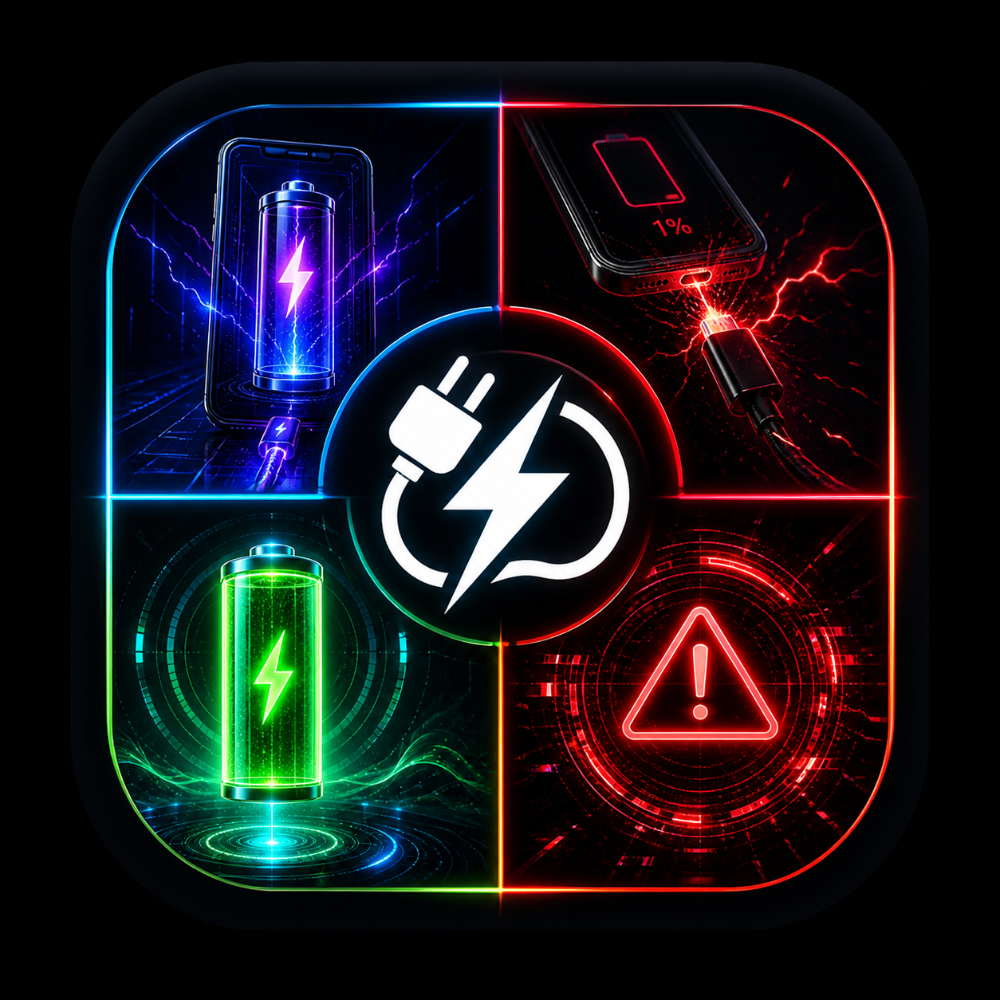
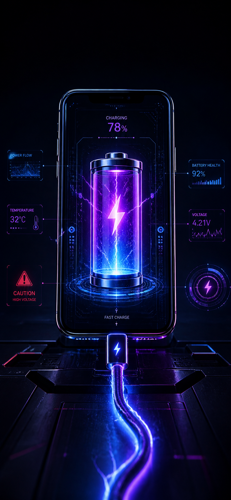
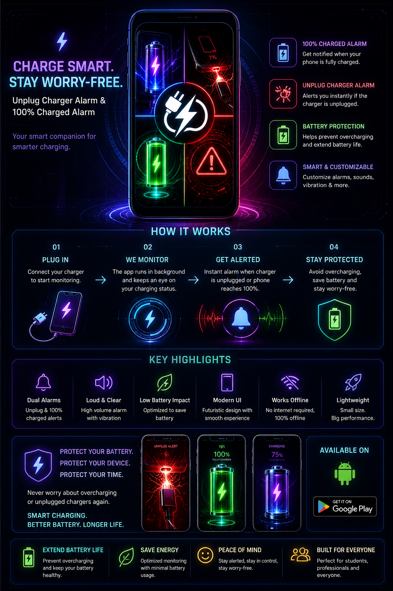
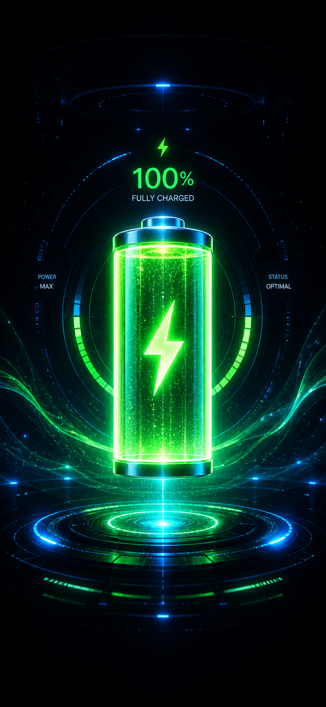
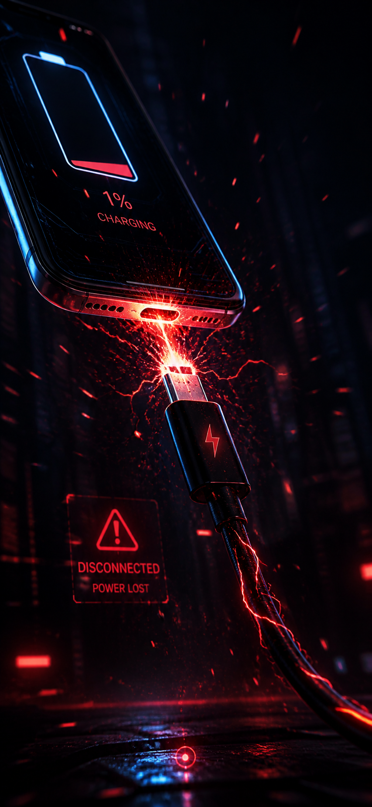

# 
🛡️ SAFE-CHARGING (AutoBeep)

  

  <b>The Ultimate Cyberpunk Security Overwatch for Android</b>

  
  
  

---

## ⚡ SYSTEM CAPABILITIES

**SAFE-CHARGING** is not just a battery app; it is a dedicated security hub for your device. Designed with a high-fidelity cyberpunk aesthetic, it combines military-grade reliability with state-of-the-art UI/UX.

### 🧬 Core Modules

| Module | Description | Impact |
| :--- | :--- | :--- |
| 🔋 **Full Charge Shield** | Prevents battery degradation by alerting at 100%. | **High** |
| 🔌 **Unplug Overwatch** | Triggers a 100dB alarm if the charger is removed. | **Critical** |
| 🔊 **Irritating Tones** | 10 medically-designed frequencies (Siren, Nuclear, etc). | **Extreme** |
| 📞 **Neural Link Dial** | Automatically calls emergency contacts if disarm fails. | **Essential** |
| 🎆 **3D Blast Engine** | Interactive shockwave animations for haptic feedback. | **Premium** |

---

## 📸 INTERFACE OVERVIEW

  
  
  

  <i>"Where aesthetics meet absolute reliability."</i>

  
  

---

## 🛠️ HARDWARE & LOGIC

- **Engine:** Jetpack Compose (Kotlin)
- **Audio:** Synthetic Frequency Generator (Low-level AudioTrack)
- **Security:** High-Priority Full Screen Intent Pop-over
- **Compatibility:** Android 8.0 to Android 14+ (FGS Special Use)

---

## 📥 INITIALIZATION

1. **DOWNLOAD:** Grab the latest binary from the [Actions Tab](https://github.com/jogeshd/AUTOBEEP/actions).
2. **INSTALL:** Side-load onto your Android device.
3. **AUTHORIZE:**
    - Grant **Display Over Other Apps** (for immediate pop-up).
    - Grant **Call Phone** (for emergency speed dial).
    - Disable **Battery Optimization** (for background persistence).

---

  © 2026 SAFE-CHARGING PROJECT. SYSTEM STATUS: <b>OPERATIONAL</b>

  

